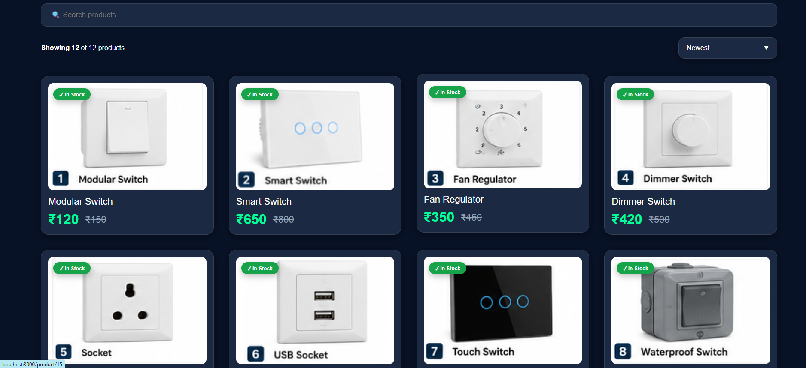
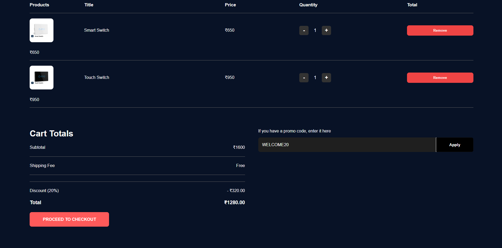
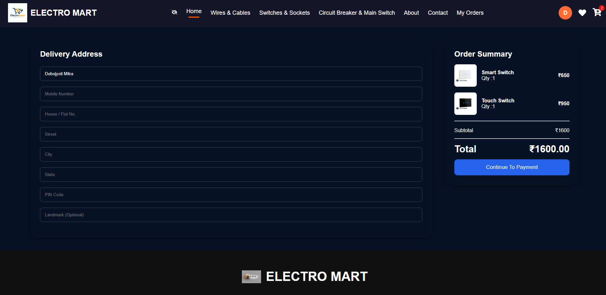
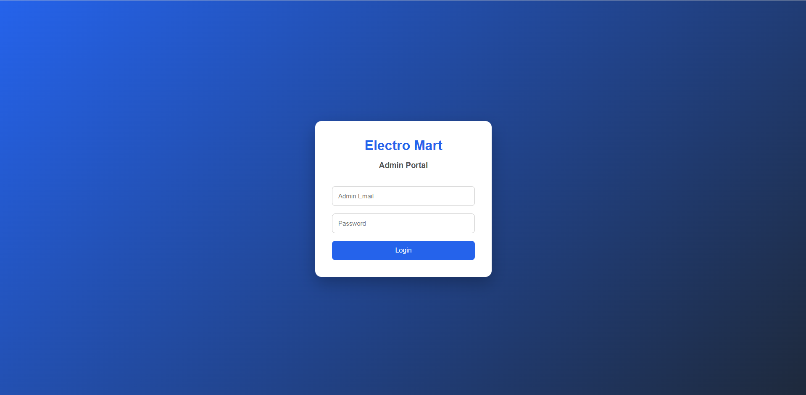
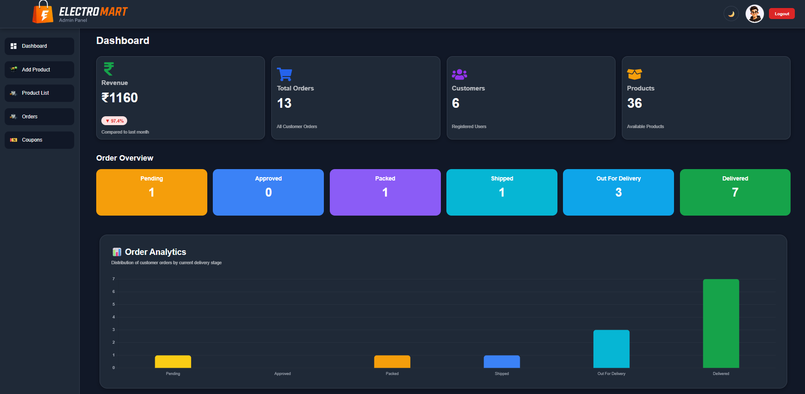
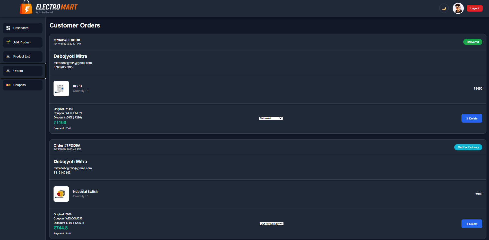

# ElectroMart

### Full-Stack E-Commerce Platform

ElectroMart is a full-stack e-commerce platform designed for selling electrical and electronic products. The application provides a complete customer shopping experience along with a protected administration panel for managing products, inventory, orders, coupons, and sales data.

---

## 🚀 Features

### 👤 Customer

- User registration and login
- JWT-based authentication
- Google authentication
- Product browsing
- Category-based product browsing
- Shopping cart
- Wishlist
- Real-time product stock availability
- Coupon application
- Secure Razorpay payment integration
- Order placement
- Order tracking
- Order cancellation
- Invoice generation
- Order status email notifications
- Responsive user interface
- Dark mode

### 👨‍💼 Admin

- Protected admin login
- Role-based authorization
- Dashboard with sales statistics
- Monthly sales analytics
- Product management
- Add products
- Delete products
- Update product stock
- Order management
- Update order status
- Cancel orders
- Permanently delete orders
- Coupon management
- Add coupons
- Delete coupons

### 🔐 Security

- JWT authentication
- Role-based access control
- Password hashing with bcrypt
- Protected admin routes
- Protected API endpoints
- Environment variable based configuration

---

## 🛠️ Technology Stack

### Frontend

- React
- React Router
- CSS
- Material UI
- React Icons

### Admin Panel

- React
- Vite
- React Router
- Chart.js
- Material UI
- React Icons

### Backend

- Node.js
- Express.js
- MongoDB
- Mongoose
- JWT
- bcrypt
- Nodemailer
- Razorpay

---

## 🏗️ Project Architecture

```text
ElectroMart
│
├── frontend/
│   └── Customer-facing React application
│
├── admin/
│   └── Protected React + Vite administration panel
│
├── backend/
│   ├── config/
│   ├── controllers/
│   ├── middleware/
│   ├── models/
│   ├── routes/
│   ├── templates/
│   └── utils/
│
└── README.md
```
---
## 🔄 Application Flow

```text
Customer
   │
   ▼
React Frontend
   │
   ▼
Express REST API
   │
   ├──────────────► MongoDB
   │
   ├──────────────► Razorpay
   │
   └──────────────► Email Service
   │
   ▼
Order / Product / User Management


Admin
   │
   ▼
Admin React + Vite
   │
   ▼
Protected Admin API
   │
   ▼
Express Backend
   │
   ▼
MongoDB
```
---

## 🔑 Authentication

ElectroMart uses JWT-based authentication.

Customer authentication supports:

- Email/password login
- Google authentication

Administrative access uses role-based authorization.

Only users with the `admin` role can access protected administrative APIs.

---

## 💳 Payment

Razorpay is integrated into the checkout process to process customer payments.

The application also maintains payment and order status information for administrative order management.

---

## 📦 Order Management

Customers can:

- Place orders
- View orders
- Track order status
- Cancel orders

Administrators can:

- View customer orders
- Update order status
- Cancel orders
- Permanently delete orders

Cancelled orders are hidden from normal order views while remaining available in the database unless permanently deleted by an administrator.

---

## 🎟️ Coupon System

Administrators can create and delete discount coupons.

Customers can apply valid coupons during checkout and receive the corresponding discount.

---

## 📊 Admin Dashboard

The administration dashboard provides information such as:

- Total sales
- Orders
- Customers
- Products
- Monthly sales data
---

## ⚙️ Local Development

### 1. Clone the repository

```bash
git clone https://github.com/DEBOJYOTI121/ElectroMart.git
cd ElectroMart
### 2. Backend

```bash
cd backend
npm install
node index.js
```

### 3. Frontend

Open another terminal:

```bash
cd frontend
npm install
npm start
```

### 4. Admin Panel

Open another terminal:

```bash
cd admin
npm install
npm run dev
```
---

## 🔐 Environment Variables

ElectroMart uses environment variables to store sensitive configuration such as database credentials, authentication secrets, payment credentials, and API configuration.

Example environment files are included in the repository:

```text
backend/.env.example
frontend/.env.example
admin/.env.example
```

Create your own `.env` file in each application directory and add the required values.

### Backend

```env
PORT=4000
MONGODB_URI=
JWT_SECRET=
RAZORPAY_KEY_ID=
RAZORPAY_KEY_SECRET=
EMAIL_USER=
EMAIL_PASS=
```

### Frontend

```env
REACT_APP_API_URL=
```

### Admin

```env
VITE_API_URL=
```

> **Important:** Never commit real passwords, database credentials, API keys, payment secrets, or email credentials to GitHub. The actual `.env` files are excluded from version control using `.gitignore`.

---
## 📸 Screenshots

### 🏠 Customer Website

#### Home Page

#### Product Catalogue

#### Shopping Cart & Checkout

!
---

### 👨‍💼 Admin Panel

#### Admin Login

#### Admin Dashboard

#### Order Management

---

## 🚀 Deployment

ElectroMart is designed as a multi-application full-stack project:

- **Customer Website** — React
- **Admin Panel** — React + Vite
- **Backend API** — Node.js + Express
- **Database** — MongoDB

The production deployment configuration and live demo links will be added after deployment.

---

## 👨‍💻 Author

**Debojyoti Mitra**

GitHub:  
https://github.com/DEBOJYOTI121

---

## 📄 License

This project is developed as a portfolio project.